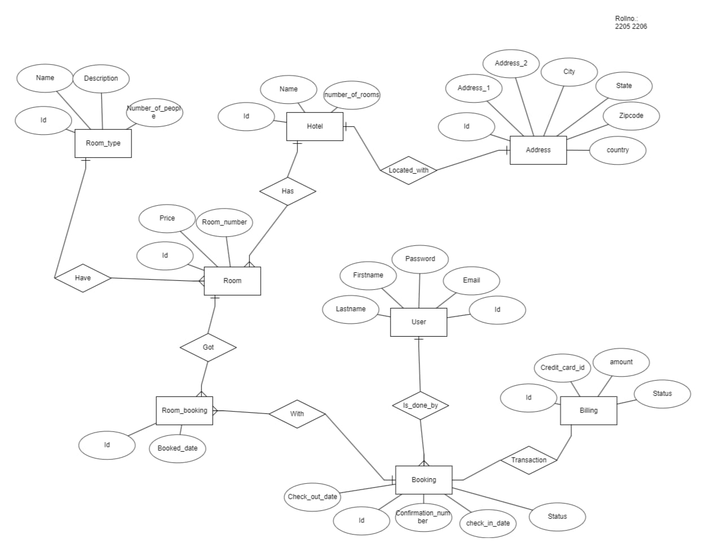

# Hotel Room Booking Management System

## Project Overview
This project is a **Hotel Room Booking Management System** implemented using SQL. It manages key aspects of hotel operations, such as room bookings, customer details, room types, billing, and hotel information. The database is designed with multiple interconnected tables to ensure data integrity and ease of querying.

## Features
- **Database Tables:**
  - `Address5`: Stores hotel addresses.
  - `Hotel5`: Contains hotel details and links to addresses.
  - `room_type5`: Defines room types and their descriptions.
  - `Room5`: Stores room details, including pricing and type.
  - `user5`: Manages user accounts and personal information.
  - `Booking5`: Tracks booking details like check-in/out dates and statuses.
  - `room_booking5`: Links bookings with specific rooms.
  - `billing5`: Handles billing information for bookings.

- **Key Functionalities:**
  - Query to retrieve hotel details with their associated addresses.
  - Query to list room types and their descriptions.
  - Query to fetch user details based on bookings.
  - Query to retrieve confirmation numbers linked with room bookings.
  - Query to display billing details for specific bookings.

## Database Schema


## How to Use
1. Clone the repository:
   ```bash
   git clone https://github.com/Shatrugna01/hotel-booking-system.git
   ```
2. Set up the database in your preferred SQL environment (e.g., Oracle, MySQL, PostgreSQL).
3. Run the SQL scripts in the following order to create tables and insert sample data:
   - Create Tables:
     ```
     CREATE TABLE Address5 (...);
     CREATE TABLE Hotel5 (...);
     ```
    
   - Insert Data:
     ```
     INSERT INTO Address5 (...);
     INSERT INTO Hotel5 (...);
     ```
     
4. Execute provided queries to interact with the database.

## Sample Queries
Here are examples of some queries included in the project:
- Retrieve all hotel names with their addresses:
  ```sql
  SELECT Hotel5.name, Address5.address_1, Address5.city, Address5.state, Address5.country
  FROM Hotel5
  JOIN Address5 ON Hotel5.address_id = Address5.id;
  ```
- List room types and their descriptions:
  ```sql
  SELECT name, description FROM room_type5;
  ```


## Technologies Used
- **SQL**: For database design, querying, and management.
- **SQL Environment**: Compatible with Oracle SQL, MySQL, and other RDBMS platforms.

## Future Enhancements
- Add advanced filtering options for bookings (e.g., by date range, room type).
- Integrate with a frontend for user-friendly interaction.
- Implement stored procedures for complex operations.
